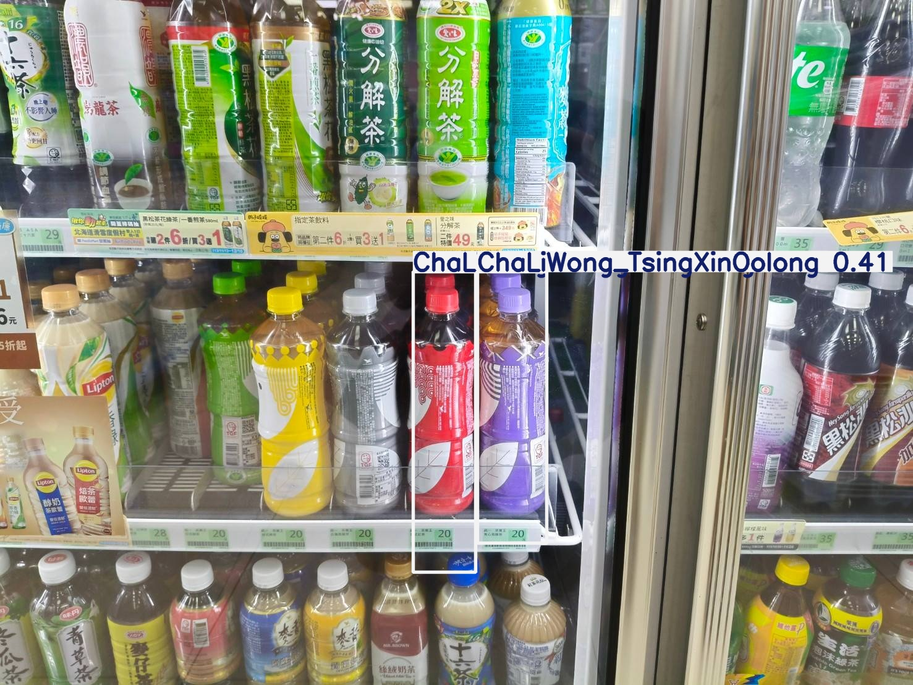
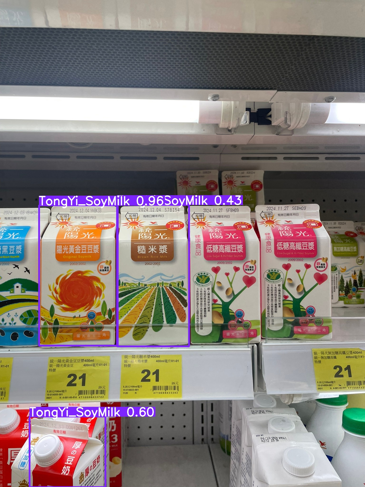
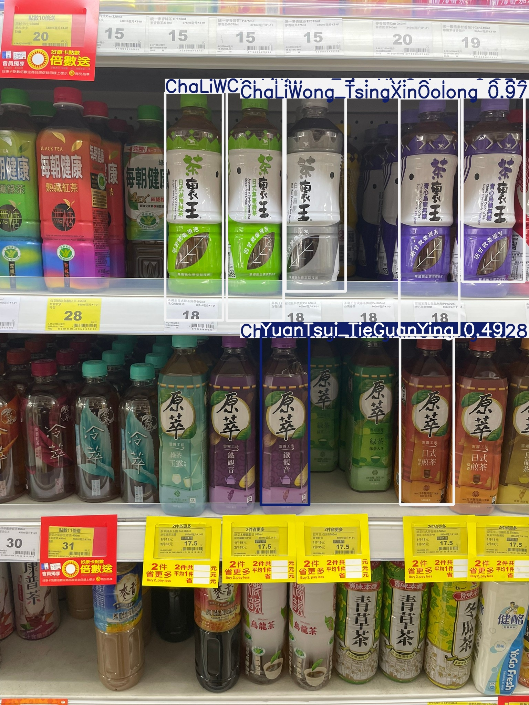
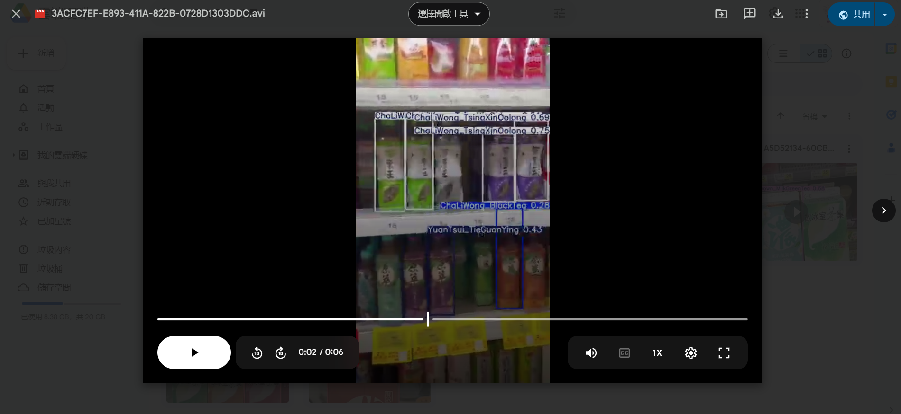
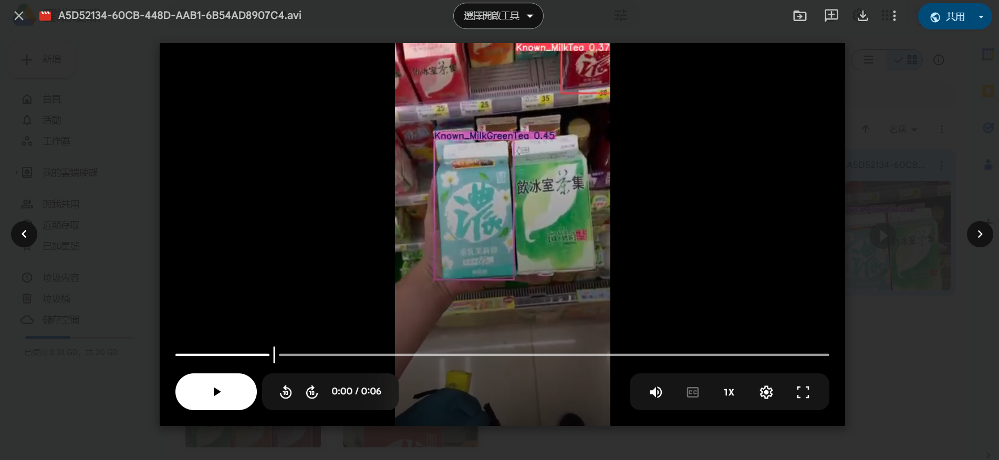

# Object-Detection-with-Beverages
This is a term project conducted in teams of Machine Learning Course in NTHU.

# Detection Details:
## Image Detection

## Video Detection Screenshot

## nc: 26
names: ['ChaLiWong_BlackTea', 'ChaLiWong_BritainBlackTea', 'ChaLiWong_TsingXinOolong', 'ChaLiWong_WhiteOolong', 'Known_ChocoMilkTea', 'Known_MilkGreenTea', 'Known_MilkTea', 'MeiChou_BlackTea', 'MeiChou_GreenTea', 'RiYue_BlackTea', 'RuiSui_AppleMilk', 'RuiSui_ChocoMilk', 'RuiSui_MaltedMilk', 'RuiSui_Milk', 'TongYi_LowSugarHighFiberSoyMilk', 'TongYi_SoyMilk', 'TongYi_UnsweetenedBlackSoyMilk', 'TongYi_UnsweetenedHighFiberSoyMilk', 'YinBinShi_MilkGreenTea', 'YinBinShi_MilkTea', 'YinBinShi_WuLongMilkTea', 'YuanTsui_BlackTea', 'YuanTsui_GreenTea', 'YuanTsui_MeiRen', 'YuanTsui_TieGuanYing', 'ZaoTsan_BlackTea']

## roboflow:
  workspace: personal-workspace-kusbp
  project: nthu-final-project-beveragedetec
  version: 6
  license: CC BY 4.0
  url: https://universe.roboflow.com/personal-workspace-kusbp/nthu-final-project-beveragedetec/dataset/6
